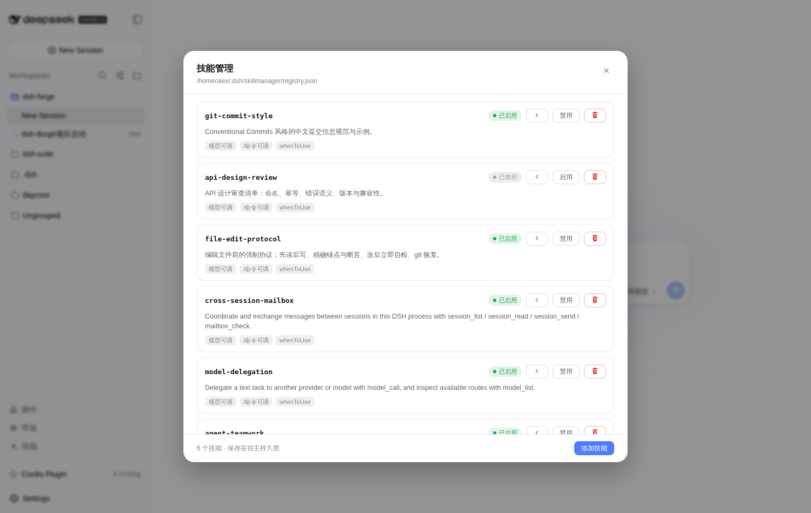
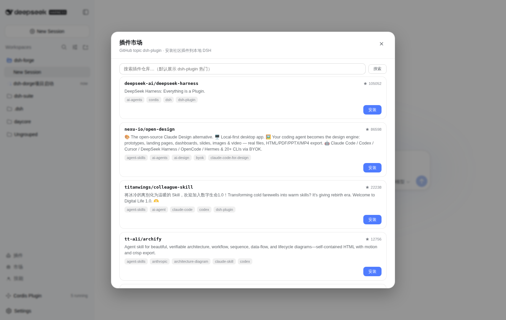
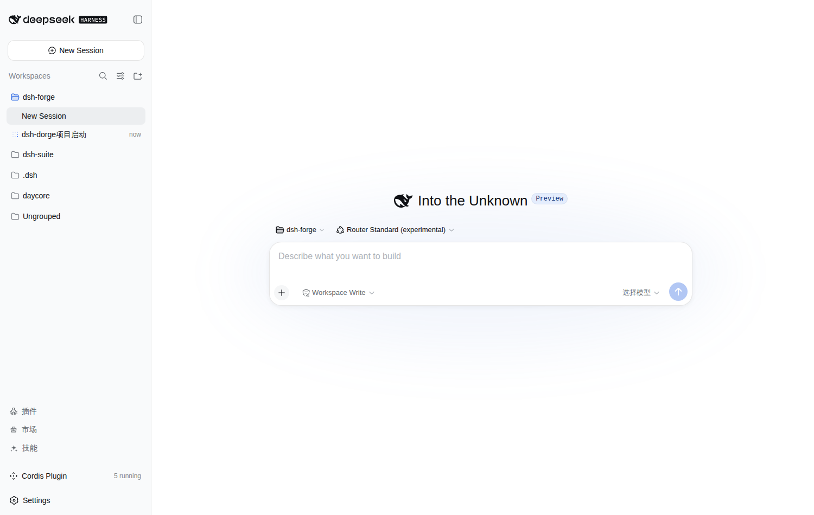

# dsh-forge · DSH 锻造台

> DeepSeek Harness 的运行时扩展套件：像 Minecraft 的 Forge 一样，为 DSH 锻造、安装、路由、编排插件。
> A runtime extension suite for DeepSeek Harness — forge, install, route and orchestrate plugins the Forge way.

Topics: `dsh-plugin` `deepseek-harness` `dsh` `cordis` · 更多社区插件见 https://github.com/topics/dsh-plugin

## 这是什么

dsh-forge 是运行在 `~/.dsh` 用户层的一整套 DSH 扩展，不 monkey-patch 任何 npm 包。核心四件套：

| 组件 | 能力 |
|---|---|
| **插件市场 + 安装器** | 浏览 GitHub `dsh-plugin` topic 社区插件，一键安装（npm 包 / 动态清单 / preset / bundle 四种形态自动识别），注入器热加载 + 持久注册表 |
| **任务感知思维模式路由**（router-standard preset） | 首条消息分类 spec（先计划）/ react（直接干）/ weak（模型自路由），首轮极简锚定 + 首个 tool/call 后放全量工具；锚定仅对 deepseek 系列生效 |
| **Skill 管理器** | 统一管理全部技能：持久化增删启停、内容预览、内置 runtime 技能（跨会话邮箱 / 模型委派 / agent 团队）收敛为一处管理，设置页面板 + 模型工具双通道 |
| **插件管理面板** | 实时发现宿主/注入/官方三类 loader 条目 + 动态插件运行/停止/删除，搜索 + 分区导航 |

协作与编排层（12 个 host 插件）：

- `mailbridge` — 跨会话邮箱：session_list / session_read / session_send / mailbox_check，离线消息持久排队、重启后自动投递
- `teamhub` — Claude-Code 风格 agent 团队：captain + 成员子代理 + 依赖排序任务板 + 成员间直连消息
- `llmrouter` — 多厂商模型委派：model_list / model_call，一次任务丢给任意 provider/model
- `modelroute` — 子代理模型继承策略（永不静默升级到更贵 tier）+ 模型系列 taxonomy + plan 计费路由
- `modeswitch` / `modsub` — 会话中途切 preset；指定模型 spawn 子代理
- `injector` — BepInEx 式运行时注入：symlink + loader.create + 持久注册表，重启自动恢复
- `dynboot` / `dynrestore` — auto-plugins.json 动态插件重启恢复 + 页面刷新重挂客户端
- `imgsub-bridge` — 子代理图片消息转附件引用

动态插件（`dynamic/auto-plugins.json`，内联 host+client 代码）：模式下拉框、模型+等级选择器、子代理图片补丁、技能管理面板、插件市场面板。

## 为什么叫 forge

DSH 的插件生态和 Minecraft 的 mod 生态很像：一个稳定的宿主（Harness），海量第三方扩展（插件），以及把这一切管理起来的装载层。Forge 就是那层——注入（装载）、路由（兼容）、市场（分发）、锻造（创作）。

## 安装

```sh
git clone https://github.com/alex04130/dsh-forge.git
cd dsh-forge
node scripts/install.mjs     # 复制到 $DSH_HOME，自动备份、幂等
# 重启 DSH（dsh web），新建会话选择 Router Standard (experimental) preset
```

或手动对照 `bundle/`、`dynamic/`、`presets/` 目录复制；npm 包形态：`dsh plugin --profile web add <path>/bundle`。

### 可选：GitHub MCP 工具（mcp__github__*）

`bundle/cordis.patch.yml` 内置 mcp-github 条目，依赖本地运行时目录 `~/.dsh/mcp/github-server/`
（不进仓库）。安装（本机 npm 全局/缓存目录可能只读，故指定 `--cache /tmp/npm-cache`）：

```sh
npm install --prefix ~/.dsh/mcp/github-server --cache /tmp/npm-cache \
  --no-bin-links --no-package-lock @modelcontextprotocol/server-github
```

token 由 DSH 进程环境变量 `GITHUB_PERSONAL_ACCESS_TOKEN` / `GITHUB_TOKEN` 提供，配置文件不落密钥。

## 验证

`npm run check`（全部 host/client 代码语法自检）。运行时验证：`dev_plugin_status`（注入器）、`skill_list`（技能）、`model_taxonomy`（路由）、`dev_router_status`（思维模式路由）。

## 截图

| 技能管理面板（两层视图） | 插件市场 | 侧栏（竖排） |
| :---: | :---: | :---: |
|  |  |  |

## 目录

```
bundle/     host 插件（cordis.patch.yml + plugins/*.mjs + @local 客户端包，可发布 dsh bundle）
dynamic/    动态插件清单（auto-plugins.json）
presets/    router-standard agent 预设
scripts/    install.mjs / check.mjs
docs/       架构文档（注入方式对比、分层规则、锚定规则、cache 规则、npm 升级风险、自研 subagent provider 设计）
```

## 架构文档

`docs/ARCHITECTURE.md` 记录全部设计决策：八种注入方式对比、host/preset/dynamic 分层规则、首轮锚定规则、prompt cache 规则、npm 升级风险清单、已知坑（勿在 React 插槽搬 DOM 等）。

## 许可与归因

MIT。改编自 [dsh-router-standard](https://github.com/yjh051108/dsh-router-standard)、[dsh-anchored-standard](https://github.com/xiaobright/dsh-anchored-standard)、[dsh-routing-suite](https://github.com/yjh051108/dsh-routing-suite)（均 MIT），详见 NOTICE。

> 历史：本项目原名 **dsh-suite**，2026-08 更名为 **dsh-forge**；`scripts/install.mjs` 的 cordis 合并标记仍保留旧拼写（`# dsh-suite:start/end`）以保证对已安装 profile 的幂等合并。
