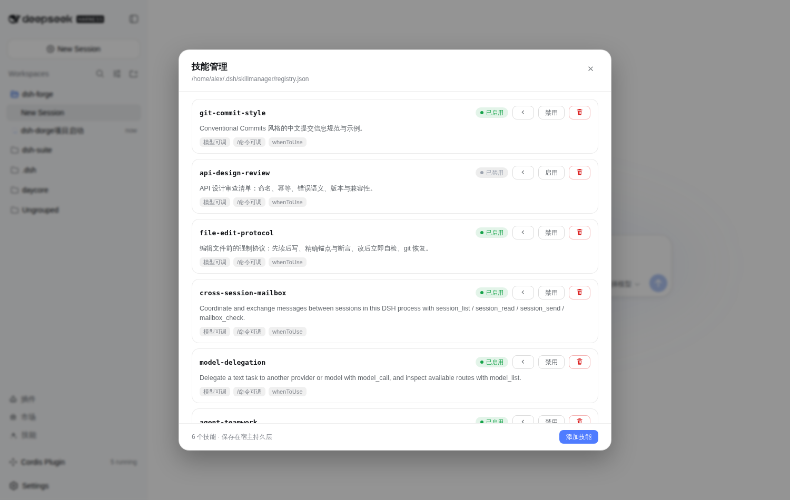
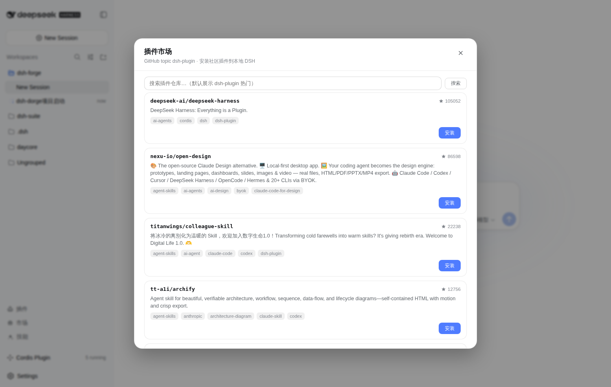
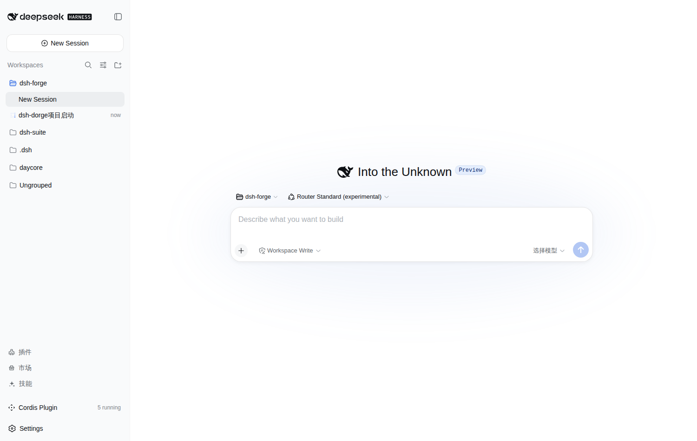

# dsh-forge · DSH 锻造台

[](https://awesome-dsh-plugin.com)

> DeepSeek Harness 的运行时扩展套件：像 Minecraft 的 Forge 一样，为 DSH 锻造、安装、路由、编排插件。
> A runtime extension suite for DeepSeek Harness — forge, install, route and orchestrate plugins the Forge way.

Topics: `dsh-plugin` `deepseek-harness` `dsh` `cordis` · 更多社区插件见 https://github.com/topics/dsh-plugin

## 这是什么

dsh-forge 跑在 `~/.dsh` 用户层，不 monkey-patch npm 包。**当前基线：DSH 0.2.0-rc.2**（Windows 官方桌面版）。源码安装会往 profile 写入 **24 行** host 组合 —— `featsw` / `console` / `mailbridge` / `llmrouter` / `modeswitch` / `teamhub` / `modsub` / `injector` / `skillmanager` / `modelroute` / `dynboot` / `forgeboot2` / `hotmgr` / `imgsubbridge` / `dynrestore` / `mailbridge-card` / `authorization` / `codexsub` / `plasmid`(默认 disabled) / `projmem` / `control` / `ui-settings-web-search` / `web-search-kimi` / `web-search-select` —— 外加 15 个 `lib/` 共享模块、3 个 `@local` 客户端包、11 个动态件与 3 个 agent 预设。

核心能力：

| 组件 | 能力 |
|---|---|
| **插件市场 + 安装器** | 浏览 GitHub `dsh-plugin` topic 社区插件，一键安装（npm 包 / 动态清单 / preset / bundle 四种形态自动识别），注入器热加载 + 持久注册表 |
| **会话中途切换模式** | `modeswitch` / `modsub`：`switch_mode`（会话中途切 agent preset，提权需确认）、`session_mode`（查任意会话当前模式）；`spawn_model_subagent` 按 provider/model 派发可续子代理。~~`router-standard` preset~~ 已删除（为修复 v4 pro-0813 的工具面过拟合），模式切换机制本身仍在 |
| **Skill 管理器** | 统一管理全部技能：持久化增删启停、内容预览、内置 runtime 技能（跨会话邮箱 / 模型委派 / agent 团队）收敛为一处管理，设置页面板 + 模型工具双通道 |
| **插件管理面板** | 实时发现宿主/注入/官方三类 loader 条目 + 动态插件运行/停止/删除，搜索 + 分区导航 |
| **会话管理** | mailbridge：`forge_mailbridge_list`（含 query 查找）/ `_list_archived` / `_archive`（`undo:true` 捞回）/ `_export` / `_read` / `_send` / `_check`。跨会话投递走官方路径 `sessionController.resolveAgent` → `steer`/`followup` → `sessions.flush`；`source.kind` 用自有值，由 `dsh-mailbridge-card` 渲染成自有图标与标题的卡片（而不是被当成人类发的消息） |
| **集群控制端点** | `control` 复用宿主 HTTP 服务挂 `/forge-control`：自签 bearer token、19 个只读与生命周期 verb、节点自报地址。**进程内实现** —— 桌面版是 Electron 独占管理的 profile，打包的 `dsh` CLI 拒绝操作它，跨机控制只能走进程内。同时替代了 console 自起 3081 端口（会与第二个实例撞端口）的做法 |

这 24 行是 host 组合的完整清单。三个 `@local` 客户端包（`dsh-plugmgr` / `dynrestore` / `dsh-mailbridge-card`）与 11 个动态件由安装器一并落地；`plasmid` 默认 disabled（文件与数据保留，去掉那一行即恢复）。

- `mailbridge` — 跨会话邮箱 + 会话管理：`forge_mailbridge_list`（加 query 就是按标题/id 找）/ `forge_mailbridge_list_archived` / `forge_mailbridge_archive`（捞回：同一工具加 `undo: true`）/ `forge_mailbridge_export` / `forge_mailbridge_read` / `forge_mailbridge_send` / `forge_mailbridge_check`
- `skillmanager` — 持久技能注册表（增删启停、默认注入）；模型工具与设置页 UI 由 `forge-ui` 动态插件的客户端半部挂在同一服务上
- `teamhub` — 代理团队：队长会话 + 成员（可续子代理，或 `existingSessionId` 拉已有 peer）+ 依赖任务板 + 消息墙（`forge_team_*`；模板合成 `forge_team_template`）
- `llmrouter` — 多厂商模型委派：`forge_model_list` / `forge_model_call`，一次任务丢给任意 provider/model
- `modelroute` — 子代理模型继承策略（不把孩子静默升到更贵档）+ 模型系列 taxonomy + plan 计费路由（`forge_model_taxonomy` / `forge_model_route_status`）
- `modeswitch` / `modsub` — 会话中途切 preset（`switch_mode` / `session_mode`）；指定模型 spawn 子代理
- `injector` — 运行时注入：symlink + loader.create + 持久注册表，重启自动恢复（`forge_dev_inject_plugin` / `_uninject_plugin` / `_reload_package` / `_plugin_status`）
- `dynboot` / `dynrestore` — auto-plugins.json 动态插件重启恢复 + 页面刷新重挂客户端
- `imgsub-bridge` — 子代理图片消息转附件引用
- `forgeboot2` / `hotmgr` — 启动引导与「全热」看门狗：动态件与静态插件的改动自动重载。`hotmgr` 现在从 `ctx.profileContext.dir` 解析当前 profile（此前硬编码 `profiles/web`，在别的 profile 下两条 watch 会静默 ENOENT 失效），client bundle 也是**扫描发现**的
- `plasmid` — 最薄质粒 v0：submit/search/get/report + gap_report，四道闸 + fitness（**默认 disabled**）
- `projmem` — 项目记忆 CRUD（`forge_memory_list` / `_get` / `_put` / `_delete`，落 `~/.dsh/project-memory/<id>/`）
- `authorization` — 模型授权 / OAuth 流（`llm-pi-ai` 的 `registerPiAiFlows` 依赖它）
- `codexsub` — **自研的持久 Codex 线程 subagent provider**，provider 名同样叫 `codex`，因此**替代**官方那行。官方 `@deepseek-ai/dsh-subagent-codex` 把 `thread/start` 写死 `ephemeral: true` 且从不调 `thread/resume`，每次派发都开一个用完即弃的线程；本实现首次开线程不带 ephemeral、之后按父会话 `thread/resume` 续接
- `ui-settings-web-search` — 官方 Web 搜索设置页（包本就在 app.asar 里，这个 profile 一直没挂过）
- `web-search-kimi` / `web-search-select` — kimi 订阅搜索提供方（已迁到 rc.2 的**声明式 Schemastery Config**，官方设置面实测返回 `autoGenerate: true`）／持久化的提供方选择（**在 rc.2 上是 no-op**：它写的 `ctx.web.searchProviderId` 属性已不存在，保留只为可回滚）

动态件（11 个，源码安装才有）：`modpk`（模式下拉）、`steer`（子代理会话 Ctrl+Enter 插话）、`forge`（forge-ui 面板族合并：壳 + 会话管理 + 能力管理；`forge-ui.config.json` 的 `features` 是独立开关，其中 `plsm` 为 `false`）、`featui`（官方 Settings → 功能开关页）。会话查找已并进 `forge_mailbridge_list({ query })`。

> **`plugmgr` 已不再挂载**：仓库与部署的 patch 里都**没有它的行**，所以 `@local/dsh-plugmgr` 的客户端半部不进 shell 模块表，面板不出现 —— 它已被**官方插件页**取代。包还留着，是为了给「插件管理要不要一个左栏座位」留选择。

## 为什么叫 forge

DSH 的插件生态和 Minecraft 的 mod 生态很像：一个稳定的宿主（Harness），海量第三方扩展（插件），以及把这一切管理起来的装载层。Forge 就是那层：注入（装载）、路由（兼容）、市场（分发）、锻造（创作）。

## 安装

**推荐：npm 包（官方插件机制，含全部 host 插件）**

```sh
dsh plugin --profile web add @dsh-forge/bundle
```

`@dsh-forge/bundle` 声明官方 `dsh.bundle.patch` manifest，`dsh plugin add` 会自动把它注册进 profile 的 patch 层；装完重启 DSH（`dsh web`）即可。需要 **0.1.4+**（0.1.3 及更早版本在 npm 路径下 boot 失败，为已知历史 bug）。npm 0.2.0-preview.1 的 insert 已含 archive / verify / plasmid：`dsh plugin add` 后随重启自动挂上（latest 0.1.4 不含这三件，装 latest 的话需 injector 或手动补 insert）。

> ⚠️ **以下是 npm 包路径，未在 0.2.0-rc.2 基线上重新验证过。**
> 本仓库当前走**源码安装**（见下方「从源码安装」）。这一节里的版本号（`0.1.4+`、
> `0.2.0-preview.1`）与"preview 与 latest 的 insert 相同（15 行）"都是 0.1.x 时代的口径；
> 现在的 host 组合是 **24 行**，且 `auto-plugins.json` 的路径要求安装器把动态件复制到
> `$DSH_HOME/dynplugins/` —— npm 包是否做了这件事没有验证过。

**预览通道（0.2.0-preview.1，`--tag preview`，不覆盖 latest）**：

```sh
dsh plugin --profile web add @dsh-forge/bundle@0.2.0-preview.1
```

**从源码安装（推荐：host 组合 + 动态件 + preset 一次到位）**

```sh
git clone https://github.com/alex04130/dsh-forge.git
cd dsh-forge
DSH_PROFILE=<你的 profile> node scripts/install.mjs   # 复制到 $DSH_HOME；自动备份、幂等、6 步
```

`install.mjs` 做六件事：

1. host 插件 → `profiles/<p>/plugins/`，**并把 `lib/` 递归复制**（每个插件都 `import './lib/…'`，漏了它全部插件都会 `failed to import`）
2. `@local` 客户端包 → `profiles/<p>/packages/`，并在 `profiles/node_modules/@local/` 建符号链接
3. **动态件** → `$DSH_HOME/dynplugins/`（`auto-plugins.json` 里的路径是相对 `DSH_HOME` 的，代码不在那儿就全是 ENOENT）
4. 合并 `cordis.patch.yml`（标记包裹，幂等）
5. 合并 `auto-plugins.json`（按 `idPrefix` 去重）
6. agent preset → `$DSH_HOME/.agent-presets/`（**递归**，含 `skills/`）

装完重启 DSH；新会话可选 `forge-team` / `forge-team-creative` / `forge-team-distill`。

> ⚠️ `dsh web` 里的 `web` 是 **profile 简写**（等价于 `dsh --profile web`）。
> 所以**不能**再叠 `--profile`，否则报 `too many arguments. Expected 0 arguments but got 1: web.`

**在独立测试 profile 上验证**（桌面 profile 做不了运行时断言）

打包的 `dsh` 拒绝操作 Electron 独占管理的 profile：

```
error: profile "desktop" is managed exclusively by the Electron application
```

所以运行时验证要另开一个独立 profile：

```powershell
$env:DSH_PROFILE='forge-test'; node scripts/install.mjs
$env:DSH_CLI='<桌面版>\resources\runtime\cli\bin\dsh.cmd'
& $env:DSH_CLI --profile forge-test --no-open --port 0
```

**集群控制端点**（自签 token 首启生成到 `$DSH_HOME/forge-control.json`）：

```sh
curl -H "Authorization: Bearer $TOKEN" http://127.0.0.1:<port>/forge-control/health
curl -H "Authorization: Bearer $TOKEN" -d '{"op":"plugins.list"}' http://127.0.0.1:<port>/forge-control
```

本路由挂在宿主**已配置的 host/port** 上；默认绑 `127.0.0.1`，跨机访问要先让节点监听对外地址。

或手动对照 `bundle/`、`dynamic/`、`presets/` 目录复制；本地路径形态：`dsh plugin --profile web add <path>/bundle`。

### 可选：GitHub MCP 工具（mcp__github__*，默认不集成）

默认不集成（`bundle/cordis.patch.yml` 已不含 mcp-github 条目）。以下为手动可选配置，
需自备 token：

1. 本地安装 MCP server（依赖运行时目录 `~/.dsh/mcp/github-server/`，不进仓库；本机 npm
   全局/缓存目录可能只读，故指定 `--cache /tmp/npm-cache`）：

```sh
npm install --prefix ~/.dsh/mcp/github-server --cache /tmp/npm-cache \
  --no-bin-links --no-package-lock @modelcontextprotocol/server-github
```

2. 在 profile 的 `cordis.patch.yml` 里手工追加 mcp-github 条目（stdio 走
   `node ~/.dsh/mcp/github-server/node_modules/@modelcontextprotocol/server-github/dist/index.js`，
   serverName=github，工具名 `mcp__github__*`）。

token 由 DSH 进程环境变量 `GITHUB_PERSONAL_ACCESS_TOKEN` / `GITHUB_TOKEN` 提供，配置文件不落密钥。

## 验证

`npm run check`（语法自检）。装完可在会话里调 `forge_dev_plugin_status`（npm 0.2.0-preview.1 为 `dev_plugin_status`）、`skill_list`、`forge_model_taxonomy`（npm 为 `model_taxonomy`）确认挂上了。维护者本机还有 `node scripts/verify-plsm.cjs`（依赖 chromium 缓存）。

## 平台支持

Windows / macOS / Linux 全平台可用：

- **路径运行时派生**：host 静态插件用 `process.env.DSH_HOME || join(os.homedir(), '.dsh')` 解析 DSH 家目录；**profile 相关路径一律从 `ctx.profileContext.dir` 取**，不要硬编码 `profiles/web` —— `hotmgr` / `injector` 过去就是硬编码的，在别的 profile 下会**静默**失效（watch 报 ENOENT、读到错的目录）。动态 host 半部没有 `process` 全局，只能经 `host.call` 拿宿主侧解析好的值。
- **注入与安装**：`scripts/install.mjs` 与注入器均带 win32 junction 回退（无符号链接权限时自动降级）。
- **动态插件 shell 操作**（插件市场等）改写为 `node -e` 跨平台实现（bash 与 pwsh 双壳安全引用），不依赖 POSIX 命令。会话查找走 `forge_mailbridge_list({ query })`，不再有独立 `session_find` 工具。
- 发布脚本 `scripts/publish-client-packages.sh` 为维护者本机专用（POSIX），不影响使用端。

## 已知限制

- **teamhub**：队长代认领的任务，成员本人无法 update（assignee 记录 memberId、鉴权用 sessionId）；`forge_team_create` / `forge_team_add_members` 的审批等待会串行阻塞其他 `forge_team_*` 调用（P1 顺延项）。
- **市场安装的插件以宿主进程权限执行**（与 `dsh plugin add` 同样无沙箱隔离）：只安装审查过来源的仓库；面板内已有警示横幅。
- **动态 client 半部禁 fetch**：面板数据面必须走 `host.call` / `harness.handle` 包私有 RPC（UI-LESSONS #16）；fs 的「不存在」是 `FS_NOT_FOUND`，不是 Node `ENOENT`。

## 对插件开发者的告诫

- **禁止经常变化的整体注入**：不要做"每次变更都整体注入"的设计：注入内容随会话累积只增不减，context 单调膨胀，token 成本与噪声持续上升。只注入增量或一次性快照。
- **避免中途 surface replace**：运行中途整体替换 surface（界面/渲染层）会让此前构建的前缀缓存全部失效，性能断崖。需更换表面时尽早替换，或做增量补丁。

（完整版与协作约定见 [CONTRIBUTING.md](CONTRIBUTING.md#对插件开发者的告诫上游审计教训)。）

## 故障排查

- **装完没生效**：host 插件、preset、动态清单的改动都要重启 DSH（`dsh web`）才生效；npm 包装完同样需重启。
- **npm 包装完没有路由 preset 与动态面板**：`@dsh-forge/bundle` 只含 host 插件与客户端包；preset 与动态面板需从源码仓库复制（见上文「可选组件」与「从源码安装」）。
- **首轮锚定/工具收窄没发生**：锚定仅对 deepseek 系列模型生效（`anchorApplies`，默认 `/^deepseek/i`）；其他系列模型全程拿完整提示词与全量工具，属预期行为。
- **npm 路径 boot 失败**：本仓库当前走**源码安装**（`node scripts/install.mjs`）。历史 `@dsh-forge/bundle` 0.1.x 在 npm 路径下有 boot 失败，未在新基线上重新验证过。
- **卸载**：`dsh plugin --profile web remove @dsh-forge/bundle` 后重启；源码安装的参照 `scripts/install.mjs` 的落点反向删除（插件、preset、`# dsh-suite:start/end` 标记块）。

## 工具定义

模型工具按插件分组（当前运行面工具名，R17 后为 `forge_*` 前缀；gitdk 默认关，不计）：

> ⚠️ **npm 0.2.0-preview.1 随包仍是前缀化前的老名**：mailbridge=`session_list` 等 `session_*`+`mailbox_check`、llmrouter=`model_list`/`model_call`、injector=`dev_inject_plugin`/`dev_uninject_plugin`/`dev_injected_list`/`dev_reload_package`/`dev_plugin_status`、teamhub=`teams`+`team_template_*`、modelroute=`model_taxonomy`/`model_route_status`、modeswitch=`switch_mode`/`session_mode`。下表 `forge_*` 为源码/新版随包名；装 0.2.0-preview.1 的按老名调。

| 插件 | 工具与用途 |
|---|---|
| **mailbridge**（跨会话消息桥 + 会话管理） | `forge_mailbridge_list`（列出会话，工作区/归档过滤，query 即查找）、`forge_mailbridge_list_archived`、`forge_mailbridge_archive`（`undo:true` 捞回）、`forge_mailbridge_export`、`forge_mailbridge_read`、`forge_mailbridge_send`、`forge_mailbridge_check` |
| **llmrouter**（模型委派） | `forge_model_list`（provider/model 目录 + byModel 反向索引）、`forge_model_call`（一次性文本补全，非子代理） |
| **modeswitch** | `switch_mode`（当前会话中途切换 agent preset，提权需确认）、`session_mode`（查询任意会话当前生效的模式） |
| **teamhub**（代理团队） | `forge_team_create` / `forge_team_add_members` / `forge_team_create_task` / `forge_team_claim_task` / `forge_team_update_task` / `forge_team_wait` / `forge_team_send_message` / `forge_team_status` / `forge_team_delete` / `forge_team_template`（save/search/distill/export/import/remove 合成） |
| **modsub**（子代理派发） | `spawn_model_subagent`（可指定 provider/model/reasoningEffort/mode/sandbox，默认全继承父，提权自动审批） |
| **injector**（运行时注入） | `forge_dev_inject_plugin` / `forge_dev_uninject_plugin` / `forge_dev_reload_package` / `forge_dev_plugin_status` |
| **modelroute**（路由策略） | `forge_model_taxonomy`（模型系列与档位）、`forge_model_route_status`（当前路由与父路由钳制） |
| **skillmanager**（技能管理） | `skill_list` / `skill_show` / `skill_add` / `skill_disable` / `skill_enable` / `skill_remove`（持久技能，支持默认注入 / 渐进式披露）。UI 由 `forge-ui` 动态插件的客户端半部提供 |
| **forge-ui**（动态插件的客户端半部） | `forge_dev_stop_dyn_plugin`（按 pluginId 前缀紧急停，与其它 `forge_dev_*` 同族）；面板挂在 `settings.section` / `sidebar.footer.action` / `conversation.composer.dock` / `conversation.session.header.actions` 四个槽位（均已对着 rc.2 原文核验存在） |
| **projmem**（项目记忆） | `forge_memory_list` / `forge_memory_get` / `forge_memory_put` / `forge_memory_delete`（落 `~/.dsh/project-memory/<id>/`，免审批；引导文件 `README.md` 不能删） |
| **control**（集群控制端点） | 不是模型工具，是 HTTP 端点：`POST /forge-control {op,args}` 与 `GET /forge-control/health\|verbs`，bearer token 鉴权。verb 表与安全边界见 [0.2.0-rc.2 适配文档](docs/ADAPTATION-0.2.0-rc.2.md) |
| **codexsub**（Codex 子代理） | 不是模型工具 —— 注册 subagent provider `codex`，由 preset 里的 `tool-subagent-codex` 行暴露为 `subagent_codex` |
| **plasmid**（最薄质粒 v0） | `plasmid_submit`（四道闸自荐）、`plasmid_search`（拉取制+适应度）、`plasmid_get`（全文）、`plasmid_report`（fitness 反馈）、`gap_report`（缺口报告，outlet 三选一） |

## 截图

| 技能管理面板（两层视图） | 插件市场 | 侧栏（竖排） |
| :---: | :---: | :---: |
|  |  |  |

## 目录

```
bundle/     host 组合（cordis.patch.yml + plugins/*.mjs + plugins/lib/*.mjs + packages/@local 客户端包）
dynamic/    dynamic/dynplugins/*.js（11 个）+ auto-plugins.json 清单 —— 安装器会复制到 ~/.dsh/dynplugins/
presets/    agent 预设：forge-team / forge-team-creative / forge-team-distill
scripts/    install.mjs（装机）/ check.mjs（结构门，--compat 加兼容断言）/ gen-compat-manifest.mjs
tests/      codexsub/ —— 假 Codex app-server 自检 harness（不需要装 codex、不联网）
docs/       ADAPTATION-0.2.0-rc.2.md（当前基线的决策与在办计划）+ 架构与工具文档
```

### 注意：`lib/` 里的 `.rN` 是**承重名**，不是版本后缀

部署的 `lib/` 里同时存在 `team-org.mjs` / `team-org.r1.mjs` / `team-org.r2.mjs`，
它们是**三个不同的模块**且同时被引用（`console-gates.mjs` 用 `.mjs`，`compdist.mjs`
与 `agent-teams-file*.mjs` 用 `.r2.mjs`）。**顶层插件名可以规范化，`lib/` 内部模块名不行** ——
把它们合并会静默打断导入链。

## 架构文档

`docs/ARCHITECTURE.md` 记录全部设计决策：八种注入方式对比、host/preset/dynamic 分层规则、首轮锚定规则、prompt cache 规则、npm 升级风险清单、已知坑（勿在 React 插槽搬 DOM 等）。经验体系（档案 / 质粒 / 缺口 / 验货）的工具级定义见 [工具详细定义参考](docs/tools-reference.zh.md)。另见 [总体规划 / 路线图](docs/roadmap.md)、[兼容性断言（COMPAT，升级 API 面核验）](docs/COMPAT.md)、[Alpha 迁移预评估（0.1.2-alpha.3 基线）](docs/audits/alpha-migration-eval-2026-09-01.md)、[工具描述规范（中文化）](docs/tool-descriptions.zh.md)、[验收测试方法论](docs/VERIFICATION.md)、[跨平台验证指南](docs/PLATFORM-VERIFY.md)、[多代理协作涌现档案](docs/EMERGENCE.md)、[自研 subagent provider 设计（提案）](docs/SUBAGENT-PROVIDER.md)、[协作约定](CONTRIBUTING.md)。运行时协作方法论与排班在 `~/.dsh/COLLAB-METHOD.md`、`~/.dsh/ROSTER.md`、`~/.dsh/UI-LESSONS.md`（不进本仓库）。

## 友情链接

- [Deepseek-Harness-EAC](https://github.com/zouyuxuan122/Deepseek-Harness-EAC) — DeepSeek Harness 的 Windows 桌面客户端：内置 Node.js + dsh CLI、一键启动、10 套内置皮肤（EAC：Embracing All Creation 揽尽万象）。

## 借鉴与致谢

只列实际参考过的项目。代码移植细节见 [NOTICE](NOTICE)。日后参考他人项目在本表加一行。idea 借鉴不写入 NOTICE，避免看起来像复制了代码。

| 项目 | 关系 |
|---|---|
| [dsh-router-standard](https://github.com/yjh051108/dsh-router-standard) | 代码移植（MIT）：路由核 |
| [dsh-anchored-standard](https://github.com/xiaobright/dsh-anchored-standard) | 代码移植（MIT）：首轮锚定 |
| [dsh-routing-suite](https://github.com/yjh051108/dsh-routing-suite) | 代码移植（MIT）：injector 思路 |
| [V1ki/dsh-plugin-subscriptions](https://github.com/V1ki/dsh-plugin-subscriptions) | **idea 借鉴，未抄代码**：订阅当 LLM provider；自写走 pi-ai 路由 + OAuth token |
| cn-humanizer（0xtresser） | 计划采用（纯 SKILL.md） |
| [DeepSeek Harness](https://github.com/deepseek-ai/deepseek-harness) | 宿主 |

## 许可与归因

MIT。代码改编来源见上表与 NOTICE。

> 历史：本项目原名 **dsh-suite**，2026-08 更名为 **dsh-forge**；`scripts/install.mjs` 的 cordis 合并标记仍保留旧拼写（`# dsh-suite:start/end`）以保证对已安装 profile 的幂等合并。